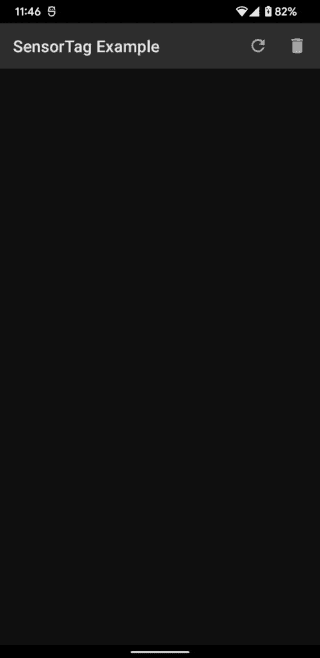

![badge][badge-android]
![badge][badge-js]
![badge][badge-mac]

# Wearout

Sample app providing connectivity/communication (connects and reads pulse sensor from Bluno Beetle Ardunio chip) with Pulse Sensor devices to demonstrate
capabilities/usage of [Kable] library.

## Android



The Android App can be built and installed via [Android Studio], or via command line by executing:

```
./gradlew installDebug
```

# License

```
Copyright 2020 JUUL Labs, Inc.

Licensed under the Apache License, Version 2.0 (the "License");
you may not use this file except in compliance with the License.
You may obtain a copy of the License at

   http://www.apache.org/licenses/LICENSE-2.0

Unless required by applicable law or agreed to in writing, software
distributed under the License is distributed on an "AS IS" BASIS,
WITHOUT WARRANTIES OR CONDITIONS OF ANY KIND, either express or implied.
See the License for the specific language governing permissions and
limitations under the License.
```


[Android Studio]: https://developer.android.com/studio
[Kable]: https://github.com/JuulLabs/kable
[Web Bluetooth API: Browser compatibility]: https://developer.mozilla.org/en-US/docs/Web/API/Web_Bluetooth_API

[badge-android]: http://img.shields.io/badge/platform-android-6EDB8D.svg?style=flat
[badge-ios]: http://img.shields.io/badge/platform-ios-CDCDCD.svg?style=flat
[badge-js]: http://img.shields.io/badge/platform-js-F8DB5D.svg?style=flat
[badge-jvm]: http://img.shields.io/badge/platform-jvm-DB413D.svg?style=flat
[badge-linux]: http://img.shields.io/badge/platform-linux-2D3F6C.svg?style=flat
[badge-windows]: http://img.shields.io/badge/platform-windows-4D76CD.svg?style=flat
[badge-mac]: http://img.shields.io/badge/platform-macos-111111.svg?style=flat
